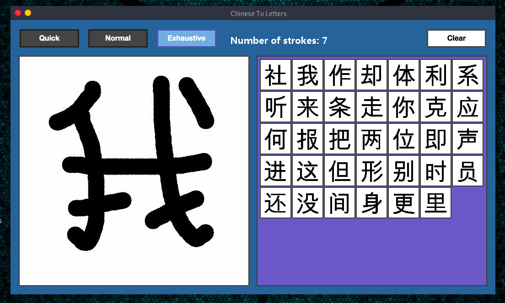
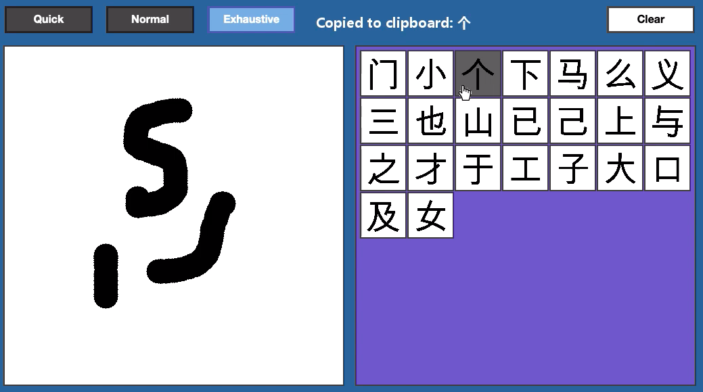
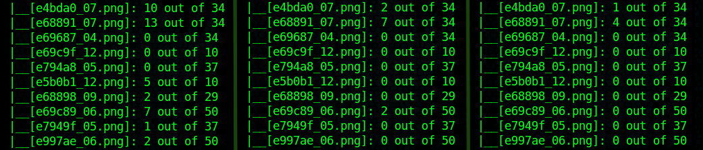
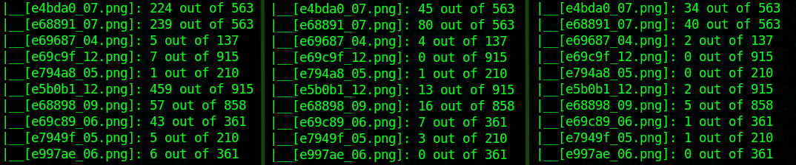

## Chinese Character Recognition app

This is a chinese character recognition app written in C which makes use of the SDL library to provide a graphical user interface. The underlying algorithm employs islands in matrices to classify the characters according to their features and provide more accurate results.

### How it works

The user is presented with a drawing pane on the left, where they can draw a character. Then, suggested characters will be presented on the right hand side grid. If they click on one of the images, that character will be copied to their clipboard for them to lookup.

There are three modes of operation in a trade-off of speed against accuracy. The first mode, quick, only performs some simple correlation coefficients calculations and is not too accurate, but really fast. The second mode, normal, counts the number of black islands in a character and filters results based on that. The last one is the slowest but most effective, as it also counts the number of white islands.

### Accuracy

THere are different character sets for the app to work with. They are based on characters popularity: the first one contains the 300 most popular, whereas the last one the 10000 most used. Below are comparisons of accuracy with some tests (0 means the drawn character was perfectly recognised and the first suggestion was the actual character). Each column represents each of the three modes: quick, normal, exhaustive.

With 300 characters:

With 9933 characters:

### Collaboration

Anyone is free to extend this project and make it better, just do PR and I'll gladly examine the improvements!
